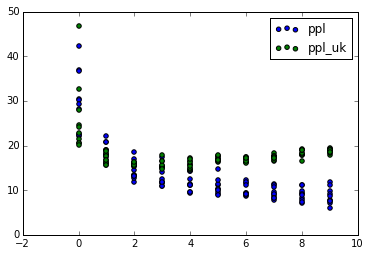
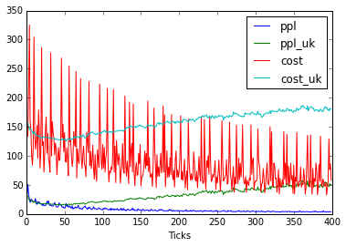
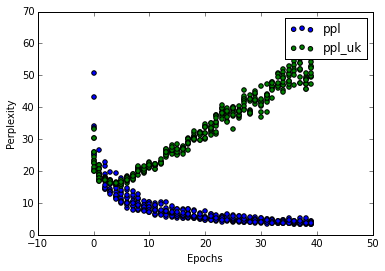

# Goal

The goal is to output some natural feeling sentences.

# Method

We will start with very few short sentences and a small network to try to make it work.
Once it works, we break it by giving more sentences, longer sentences etc.

# Experiment 1

The goal is to have a minimal working example, where all parameters are understood and easily accessible in the code, and the network outputs things that look like english words.

## Questions :
- What is a computable metrics that correlates well with a good looking output ?

  - The perplexity of the last few sentences we trained on (maybe a rolling window, this would allow us not to depend on any notion of epoch) should work.

- How long does the training take ?

  - A few minutes. Each tick is subsecond, each epoch is sub-minute.

- What is the letter_size parameter ?

  - I still don't know.

- Does the evaluation of costfun cause the network to change ?

  - No. It uses it, but does not modify the graph (I think).

- How does one reset the network to a blank state ?

  - The job of forwardIndex() is to set it up. It is called by tick. Each tick() call starts on a blank state.

- Could costfun be a good metrics ?

   - Costfun gives two metrics: perplexity and cost.
   - Costfun is evaluated on the sentence the tick works on, but I added some code to evaluate it on a string the network has never seen before.

## Methods

Il will remove everything that from the code that is not directly helpful. I can add it back later thanks to git.

Small network : 1 hidden layer of 10 LSTM units.

Small dataset : 10 short Terry Pratchett quotes, one sentence each, no special character, some words in common. File pratchett10.txt

Short training : 10 epochs.

I need to find a metric and see if it stabilizes. I run 10 epochs and output all available metrics.
First tick outputs e.g. :

S'EctpySdgY I.tb,MmHuwfYhlbgn

Imagination serlmSHYyniivLoto'd,sH r-sxenytthnwhltvcet oo,g-'oLIY.Lepwiepgntrdyad fanruv oInhdlsraeka

Lasts ticks sekected outputs include (Imagination was the primer) :

Imagination akaot cexla, thier.

Imagination carlmmiped bo uprins hakers.

You ares shed to,te doonht ines.

Which shows basic sentence structure (capital letter at the beginning, '.' at the end…)

I will now output the metrics value in a file in order to graph them, and see if I can devise a halting criteria.

I graphed them with python, file is :

 We can see that after some training, ppl goes down while ppl_uk goes up, this means that we may be overfitting the network. I'll train for more epochs to see what the effect is like on the generated strings. max_epochs goes from 10 to 40.

I ran the thing for 40 epochs,

 This is pretty clear indication of over-fitting. Some remarks, and possible halting criterion :
- As epochs go, the variance of ppl_uk increases, while the variance of ppl decreases.
- There is a point at which min(ppl_uk)>max(ppl). This could be the start of over fitting. In this run this happen at epoch 6.
- A carefully tuned variance-as-percentage-of-mean-value could make us stop when ppl converges, in this case around epoch 30.

Hand selected predicted sentences using these two criterion :
- overfitting, softmax, no primer:
  Lminschesr thmsin.
- overfitting, softmax, primer :
  Imagination anes guwarser.
- overfitting, argmax, no primer :
  Sine the the the the the the...
- overfitting, argmax, primer :
  Imagination ane the the the
- long training, softmax, no primer:
  The walde doone tiugs sasesgs coup, in tiw tu to yanglangs yers.
- long training, softmax, primer :
  Imagination ligenmens phaokes yothathat harers.
- long training, argmax, no primer :
  In mangs cothe was cathings.
- long training, argmax, primer :
  Imagination lent the was cathings.

## Results

  The code works, in that an example output :

  `In mangs cothe was cathings.`

  exhibits basic sentence structure (start with a capital, ends with a ., no misplaced punctuation) and english or english-sounding words.

  Possible stop criterion include the tipping point of the divergence between ppl and ppl_uk, of convergence of ppl within an epoch. A precise computable formulation of convergence remains to be defined.

  The code is reasonably fast.

## Future work

  Experiments need to be run to see the isolated and combined effects of :
  - working with longer sentences
  - using a larger network
  - working with more sentences

  the effects are to be studied on :

  - relevance of convergence criteria
  - computation time to convergence
  - human assessed qualitative quality of output

I suggest we start with isolated effects first.

# TODO
- Use fortune to get the sentences
- Create appropriate fortune files
  - small number of longer sentences
  - huge number of long-ish sentences
- Save the state and check the restore mechanism works.

# Experiment 2

The goal is to do away with the concept of epochs, just reading chunks from a file. If the file is huge, each chunk will probably be seen once or never, if it is small, each chunk will be seen multiple times. We keep training on sentences, but We increase the size of the dataset, and see when our small network gives up, if it does.

## Questions

Does a small network learn as well as a large one on sentences ? <-> Shall we increase the number of neurons as we increase the number of sentences (but not their size) ?

Can we learn from a set so big, it's not probable a lot of sentences will be seen twice ?

## Methods

Created a fortune file to break up the book in pieces that can be fed to the network.

Starting with the code from Exp1, make the save/restore mechanisms work.

Set up an experiment that runs for a large number of ticks, reading one sentence at a time from the book.

Set up the experiments on the server : run three different sizes of network on three different sizes of input, for the same number of ticks. Compare the perplexity graphs, compare the predicted sentences.

Mistakes on the experiment :
- `strfile` should have been rerun on the .txt file, otherwise `fortune` works weirdly (the same chunks come over and over).
- some utf8 chars (e.g. U+2014, EM DASH) do not play well with the terminal stuff over ssh, I converted everything to ASCII.

Modified the Makefile, Exp2 also tries to learn a big-ish network (100 neurons) on the whole file.

The small networks training was cancelled because of 1) a conflict in the .json files name (both training used the same names, erasing one another files), 2) not so good results.

Because of the conflict issue, I would have had to restart the training, but the not-so-good results made it clear it would serve no purpose : training many sentences on a small network is not as efficient as training on a network of appropriate size.

The "big" (100 neurons) network learned fine.

## Results

Running `make Exp2_big_inf` yelds good results. The network is trained on chunks that correspond to one sentences, from the whole book, for 50 000 ticks. Sentences can be generated by running `node src/predict.js Kurzweil_1s.txt_100_50000.json`. Example outputs :

- And there say movements.
- Manimity of the evolving.
- Are in our circunistal, is the mattering, we is plane, the popent of our genomear Tracessions for each keventalizent paper these austemind unfork will importincing will be liveabor.
-  And limed be DNA are continual manage veinance, but whethetemility of rill commands of fros passy actionally reve resrays randt to nopse complerious agine, and I deebation around generality.

We can now try to learn larger chunks. This would be Exp3

# Experiment 3

## Goal

We now want to train on large chunks.

## Methods

We want to learn on larger chunks.

Let's divide the book in paragraphs (using Python code in fortune.ipynb). Done.

Let's create Exp3 in the Makefile. Done, target name: `Exp3_100_1p`

I feel confident that a 100 neuron network will learn when fed chunks on length 1 paragraph. While we are at it, let's try feeding it 5 paragraphs at a time. Maybe it's too much and we will have to increase the network size. We'll see.

So I divide the book in chunks of 5 paragraphs. Done.

I will increase the number of ticks, as well. Let's go to 100000 by modifying src/test.js.

I create the target `Exp3_100_5p` in the Makefile.

The experiments are launched. Ticks are way longer than with smaller chunks (this is expected). I also, by running `fortune Kurzweil_5p.txt` saw that sometimes a number is appended at the end of a sentence. Maybe it's the page number that messes up in txt format. A Regexp cleaning could get rid of that. We'll keep in mind that the output of the netwok, if it has some quirkiness to it, should be compared to the output of fortune...

The code for Exp3 hanged, because of an infinite loop in samplei(), because of a NaN value somewhere

I removed the call to predictSentence() (which was in turn calling samplei()) hoping that the training would go on. Sadly it does not. After more than 60 000 ticks, the system outputs garbage.

I'll try to debug the code.

The first step is to reproduce the bug. I undid the modifs I made that allowed for the code to run despite the bug. The code hangs after some chunks. I'll try to make it less random by not using fortune to select the chunks. The chunks will be hardcoded instead.

I do this work in bug.js, which starts as a copy of test.js.

By the way I notice that removing some special characters from the text (such as '-') concatenates words (e.g. constrasta instead of 'constrast - a'...). FIXME this.

I remarked while chasing the bug for the first time that long sentences seem to trigger it.

In commit [master 2351119], the bug appears when running src/bug.js at sentence 3.

I reran it a few times, the bug always appear at sentence 3, this indicates that the (I suppose random) initialization of the network has little to no impact on the bug.

I run the tick() function on just sentence 3, to see if the bug is caused by the contents of sentence 3 or by the training, using all 3 sentences one after the other.

I removed sentence 1 and 2 : the code runs at sentences 3 and 4, but fails (tested a few times) at 5.

Added sentence 2 back : fails at 4.

Added sentence 1 back, but removed 2 again (the sequence is 1 3 4...) : fail at 4.

It seems to fail at the third message, whatever the message. Strange. I have a hunch the failure may be triggered after a certain amount of data has gone through the network.

I will not act on this hunch now, time to dive in the code instead.

The bug is that the sum of the argument w to samplei is NaN.

Are all the values of w NaN or only one ? The 86 values of w are NaN. (There are 85 ≠ chars plus the end-of-string char).

So, where dos w comes from ? It was returned from R.softmax.

Does the input of R.softmaw has any NaNs in it ?
Yes, all 86 values of m.w are NaNs, long before softmax is called by predictSentence.

So, where does the first call to softmax with NaN arguments comes from ? It is somewhere in costfun.
Nans begin to appear sometime during the loop in costfun(). softmax is not the culprit, the first NaN appears in its argument, which was constructed by forwardIndex().
It's in line
var output = G.add(G.mul(model['Whd'], hidden[hidden.length - 1]),model['bd']);
visual inspection reveals no NaNs in model, let's check hidden

There are NaNs in some indices of hidden.

Going up a few lines, I check and there are NaNs in hidden_d. Let's check the arguments of eltmul()

The second argument of eltmul is NaN-ed. This is the output of G.tanh()

Let's check the arguments of G.tanh(). It's the output that becomes NaN.

I've caught Math.tanh() in the act of returning NaN for an input of 709.9954609728775.

Using src/test_tanh.js, it appears that tanh returns NaN for values absolutely higher than 709.8000000000928.

I submitted a pull request upstream: https://github.com/medikoo/es5-ext/pull/28

Now let's find a workaround in the meantime.
One way to do it may be to use strict mode, I hope

https://stackoverflow.com/questions/9031888/any-way-to-force-strict-mode-in-node

# Perplexity bug

When loading up a network state from a .json file, the perplexity is higher than what it used to be when the network's state was saved.

- What exactly is the perplexity ?

The input layer is the same size as the alphabet. One neuron per letter. Sentences are given to the network, one letter at a time.

There is a hidden layer.

On the output layer (which is the same size as the input layer) a letter is chose thanks to a probabilty distribution computed from the values of the neurons (c.f. Softmax function).

The perplexity grows with the uniformity of the probabilty distribution.

Let's say I want my network to output "This is an example sentence."

I will feed it the START_SIGNAL. Then I look at the perplexity of the letter 'T'.

Then I feed it the letter 'T', and I look at the perplexity of letter 'h'.

And so on...

The perplexity is the sum of -log(Prob of choosing the correct letter) for all letters of the target sentence.
This value if low (log(1) == 0) if the prob is close to 1. It's higher if the probability is small (because -log(x) -> Inf when x->0).

cf. train.js:256 /log2ppl/

- On what sentence is the perplexity being computed ?

At each tick, you give the network a new sentence to learn from. The perplexity is computed on the sentence the network just learned on.

It's also computed on a sentence that do not appear in the dataset.

train.js:303 /cost_struct_on_unknown/

- Write a piece of code to reproduce the bug *quickly*.

I try to learn a short sentence to speed up the execution.

But when I load the network, I see no significant spike in perplexity. ??

Let's try feeding a different sentence to the network at every tick.

This time (I tried five times in a row), the perplexity when we load the network is indeed higher (but by a small amount) than when we saved it.

- Why ?

I suspect that some objects that have an interesting value when the code is run are not initialized wiht those values when we load a state, because those objects are not saved.

- What are we saving actually ?

We save the model and some global variables

- What do we not save that may actually be useful ?

I make it so one sentence is associated with one tick, and the network is fed the same sentence whether it executed from tick 0 to now, of just loaded from a file.

I notice that the perplexity is higher on the tick after we load, not the tick at which we load.

When we load, we call train(), which call tick(), which computes the perplexity from the model (which we just loaded) and the sentence (we made sure it is the same in both the execution from the beginning and the execution from the file). The perplexity is the same, because same input means same output.

But then, in tick(), we reach a call to solver.step(). This object (solver) is not loaded from the file. Therefore the values in it are not the same in the two executions. Because this function (solver.step()) take model as an argument, it's probable it modifies it. From this point on, model is not the same in both execution paths.

I propose to save the variable solver as well.

This was not done in the original library. I do really hope it was just to save developper time, and not because for some reason solver is un-savable.

I wrote the code for saving and and loading the solver object. Now both curves are the same. I believe the bug is solved.
